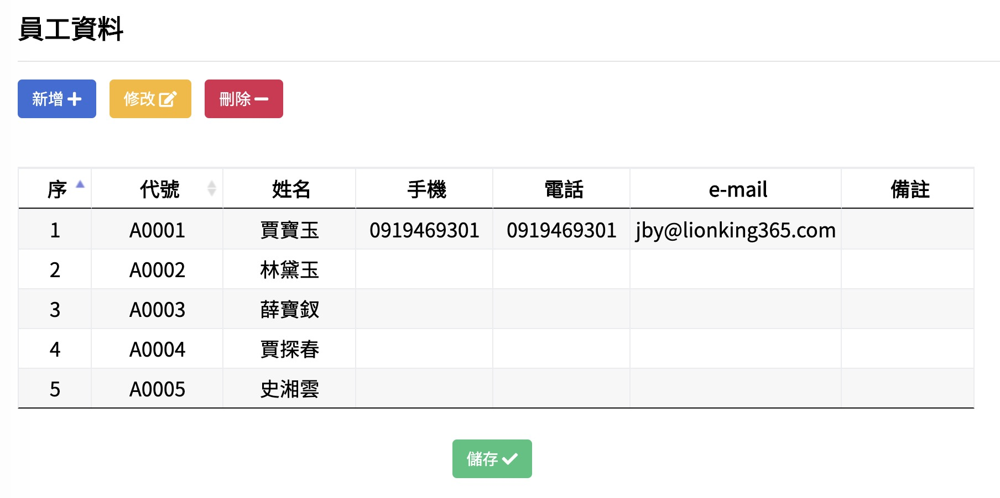

# 1.2員工資料

## 新增

#### step1.【按下左上角的 新增+ 】

#### step2. 填入資料

#### step3.【按下右下的 確定V 】

記得【儲存】！

## 修改

#### step1. 點選一列要修改的列 然後【按下左上角的 修改 】

#### step2. 修改資料

#### step3.【按下右下的 確定V 】

記得【儲存】！

備註：本程式的所有修改的方法均相同 之後不再重複說明

## 刪除

#### step1. 點選一列要刪除的列 然後【按下左上角的 刪除 】

#### step2. 修改資料

#### step3.【按下 確定V 】

記得【儲存】！

備註：本程式的所有刪除的方法均相同 之後不再重複說明

