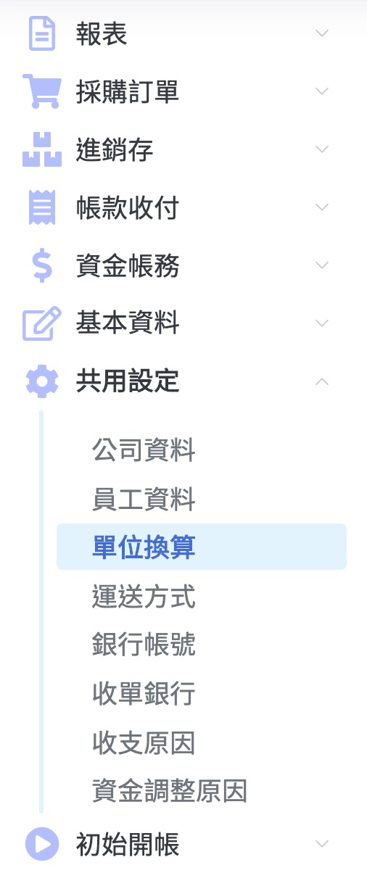

# 1.3單位換算

## 新增

#### step1.【按下左上角的 新增+ 】之後會彈出 新增單位換算框框

#### step2.  新增單位填入資料 第一個新增單位是庫存單位 如果要增加大單位\(進出貨）在修改的  時候加入  本例子用衛生紙1【包】有 12【個】 庫存單位是個做例子

#### step3.【按下右下的 確定V 】

記得【儲存】！

## 修改

#### step1. 點選一列要修改的列 然後【按下左上角的 修改 】

#### step2. 修改資料 本例子大單位填入【包】 然後換算數量填入12 即可

#### step3.【按下右下的 確定V 】

記得【儲存】！

備註：若大單位不想用了 在大單位填入【 - 】即可

