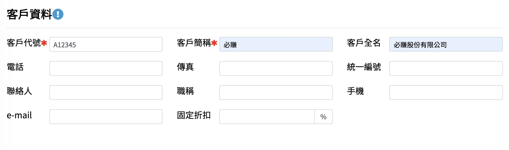
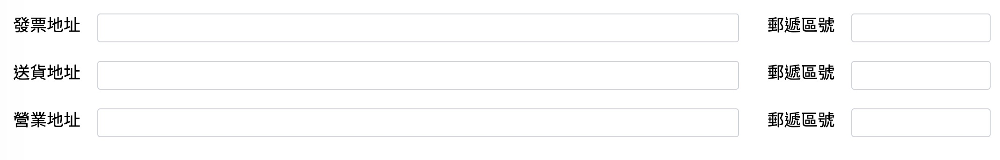

# 1.6客戶資料

溫馨提示:【客戶資料】【廠商資料】【商品資料】輸入完成後 進銷存軟體就可以開始使用了！

## 新增

#### step1.【按下左上角的 新增+ 】之後會彈出 框框

#### step2.  填入資料 這邊以必賺股份有限公司做例子 客戶代號則由公司自行編碼 若【統一編號】【送貨地址】【郵遞區號】有填入資料 未來銷貨單填單時 這些資料都會自動帶入 【結帳日】【收款日】則是若客戶採用月結方式付款 則此兩組資料在銷貨單填單時 會自動帶入

#### step3.【按下下方的 確定V 】

記得【儲存】！

