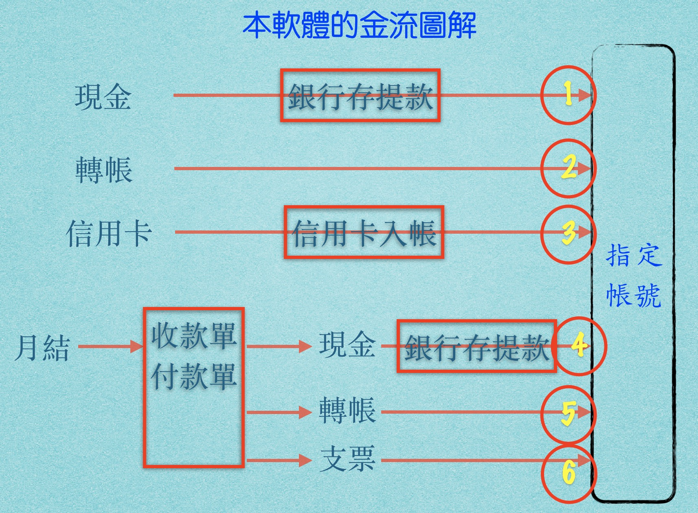
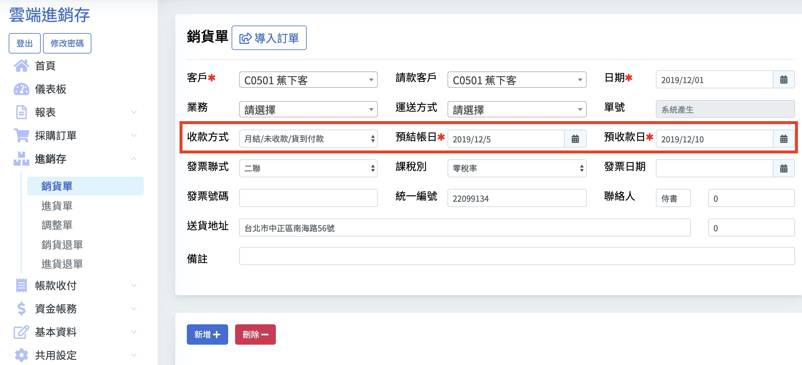
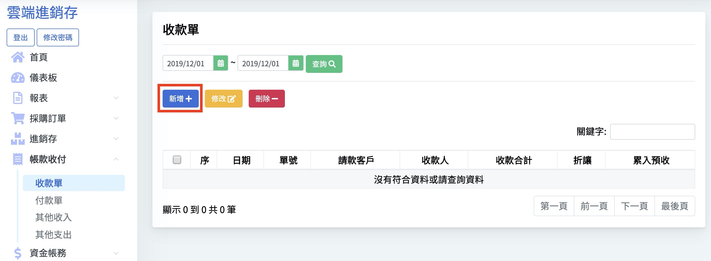
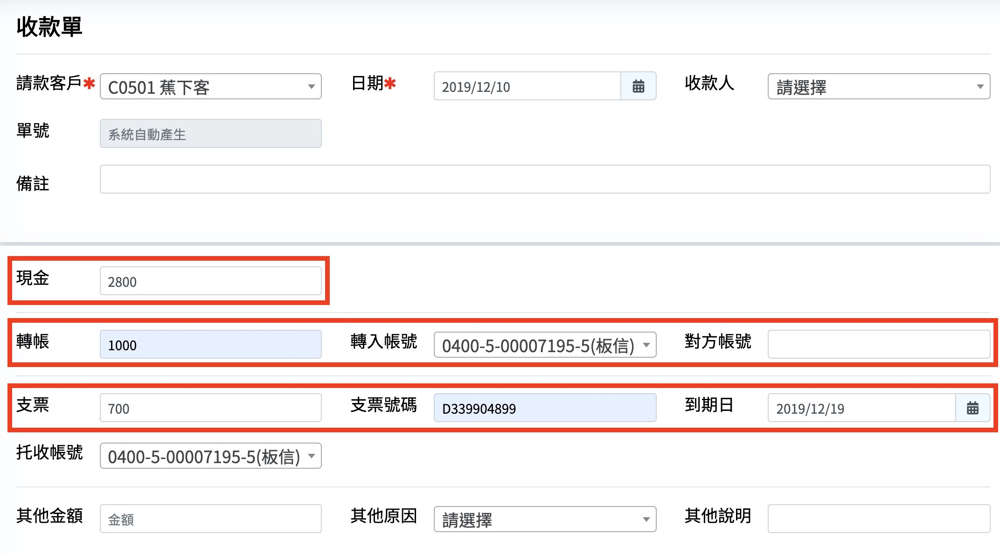
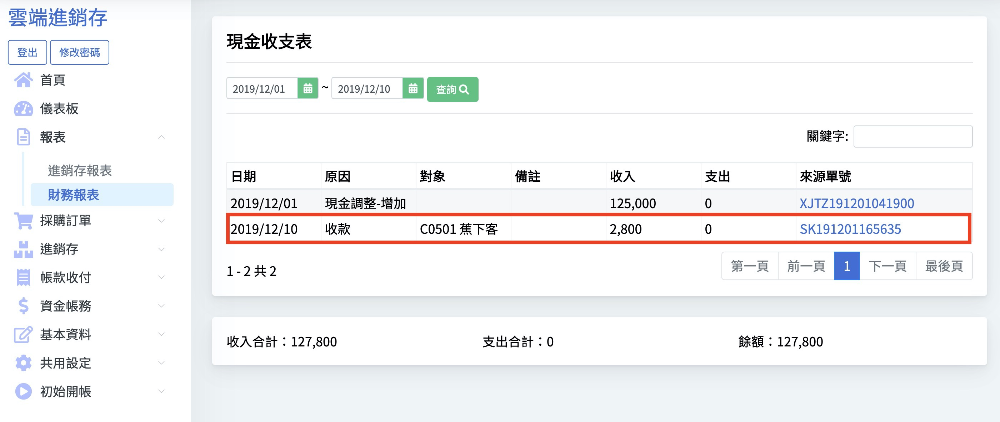
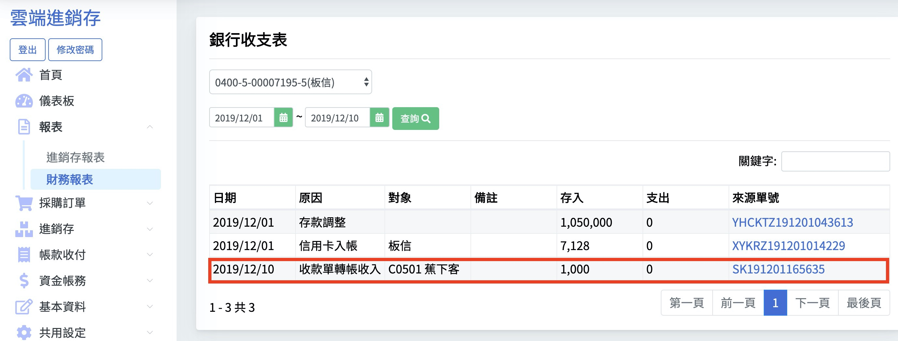

# 4.5收款單

#### 月結都要用收款單沖帳

本節介紹路線4、5、6

## 現金查帳

## 銀行查帳

因為支票到期會自動兌現  帳目也會自動出現在銀行收支表 所以查帳的時候要特別注意

雖然客戶不太可能一次用3種方式付款  這個例子是為了說明 一次用了三種方式付款 查帳的方式也跟前面的現金 轉帳的查帳方式相同 在此不贅述

  
恭喜  您已經完成全部的使用手冊

雖然我們大部分都介紹銷貨 入帳的動作

但是出帳的動作是完全一樣的

只是改成 出貨單 付款單

獅子王365還有很多功能 但是我們認為

只要以上內容全部都會 您自然就能夠自學

 所以我們就不用教科書的方式 

一個一個的教學

接下來...我們要聽取客戶的意見

在未來的日子裡 加入客戶所需要的功能

讓獅子王365 雲端進銷存更加豐富

期待您的加入！！賺錢 就要用獅子王365！

